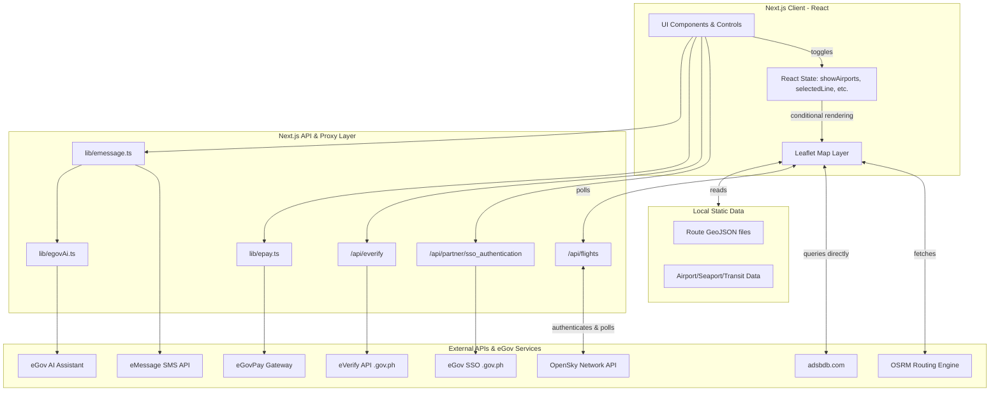

# eGuide System Architecture

This document outlines the high-level architecture, data flow, state management, and external API integrations for the eGuide project.

## 1. High-Level Architecture Diagram

## 2. Map Rendering Layer (Frontend)

- **Library:** React-Leaflet (`MapContainer`, `TileLayer`, `Polyline`, `Marker`, etc.).
- **Base Map:** Currently utilizes Stadia Maps Dark tiles (with OpenStreetMap contributors attribution).
- **Data Overlays:**
  - **Transit Lines:** Train and Bus lines are mapped using local `GeoJSON` or route coordinate arrays.
  - **Routing:** Uses OSRM (Open Source Routing Machine) to accurately map complex road-following paths for buses rather than drawing straight lines.
  - **Static Markers:** Airports, Seaports, and stations are loaded directly from static TypeScript arrays (e.g., `philippineAirports.ts`).

## 3. Live Data Sources & Proxies

The map overlays live tracking data sourced from external APIs:

- **OpenSky Network (Live Aircraft):**
  - Tracked aircraft positions are polled via the Next.js server route `/api/flights`. This acts as a proxy to safely cache OAuth2 Bearer tokens on the server and bypass browser CORS restrictions.
- **Adsbdb.com (Flight Routing):**
  - When an aircraft is clicked, the client directly queries `adsbdb.com` with the aircraft's Callsign to retrieve the origin and destination details.
- **Calculations:** ETA and proximity calculations (using the Haversine formula) are executed dynamically on the client within `MapComponent.tsx`.

## 4. Client-Side State Management (Layer Toggling)

Map layers are toggled using standard React state (`useState`) within the central `MapComponent.tsx` file:

- **State Variables:** `showAirports`, `showSeaports`, `showLiveAircraft`, and `selectedLine` determine which layers and controls are visible.
- **Toggling Logic:** Dropdowns and UI buttons invoke standard state setters (e.g., `setShowAirports(!showAirports)`). The React-Leaflet components react to these state changes by conditionally rendering `<Marker>`, `<GeoJSON>`, or custom popup components.
- **Visual Feedback:** When a specific transit line is chosen (`selectedLine`), the properties of unrelated polylines are adjusted to appear "faded" (reduced opacity and thickness).

## 5. Philippine Government (eGov) API Integrations

eGuide integrates with several mock/sandbox eGov endpoints to demonstrate unified national digital infrastructure. 

### 1. eGov SSO Authentication
- **Endpoint URL:** `https://hackathon-sso.e.gov.ph/api/partner/sso_authentication` (configurable via `EGOV_SSO_BASE_URL`).
- **Consumed At:** `app/api/partner/sso_authentication/route.ts`
- **Auth Method:** Bearer token forwarded directly from the client.
- **Request/Response:** Client sends `Authorization: Bearer <token>`. The server validates this against the eGov SSO endpoint and returns the authentication status.

### 2. eGovPay (Mobile Wallet & Payments)
- **Endpoint URL:** `https://egovpay-pgi-ws-dev.oueg.info/api/v1/transaction`
- **Consumed At:** `lib/epay.ts` (Triggered via UI payment flows and `/api/epay/...` routes).
- **Auth Method:** Secure HMAC-SHA256 digest signature and an `X-eGovPay-Token` HTTP header.
- **Request/Response:** Submits a JSON payload with `amount`, `settlement_template_uuid`, `digest`, `txnid`, and return URLs. The API returns a gateway checkout URL and transaction UUID.

### 3. eGov eMessage (SMS Proximity Alerts)
- **Endpoint URL:** `https://hackathon-emessage-api.e.gov.ph/messaging/v1/sms/push`
- **Consumed At:** `lib/emessage.ts`
- **Auth Method:** API key sent via the `X-EMESSAGE-Auth` header.
- **Request/Response:** Sends a JSON payload `{ number, message }`. Returns success verification.

### 4. eGov AI Assistant ("Puno Na-Bayan?" & Dynamic Alerts)
- **Endpoint URLs:** 
  - Token: `https://egov-ai-core-ws.oueg.info/api/v1/egov/integration/token`
  - Generation: `https://egov-ai-core-ws.oueg.info/api/v1/egov/integration/ai_assistant/generate`
- **Consumed At:** `lib/egovAi.ts` (often chained with eMessage to send AI-generated transit updates).
- **Auth Method:** Exchanges an `EGOV_AI_ACCESS_CODE` for a short-lived Bearer token, which is then used for the generation request.
- **Request/Response:** Submits a prompt containing live distance/speed metrics. The AI returns a concise, natural-language SMS alert optimized for commuters.

### 5. eVerify (eKYC & Identity Verification)
- **Endpoint URLs:** 
  - Auth: `https://hackathon-everify.e.gov.ph/api/auth`
  - Query: `https://hackathon-everify.e.gov.ph/api/query`
- **Consumed At:** `app/api/everify/route.ts` (Hit during the user onboarding/login flow).
- **Auth Method:** Standard server-to-server Client ID / Client Secret exchange for an access token, followed by Bearer token authorization.
- **Request/Response:** Submits basic demographics (name, DOB) alongside a `face_liveness_session_id`. Returns boolean verification status and protected identity details.
